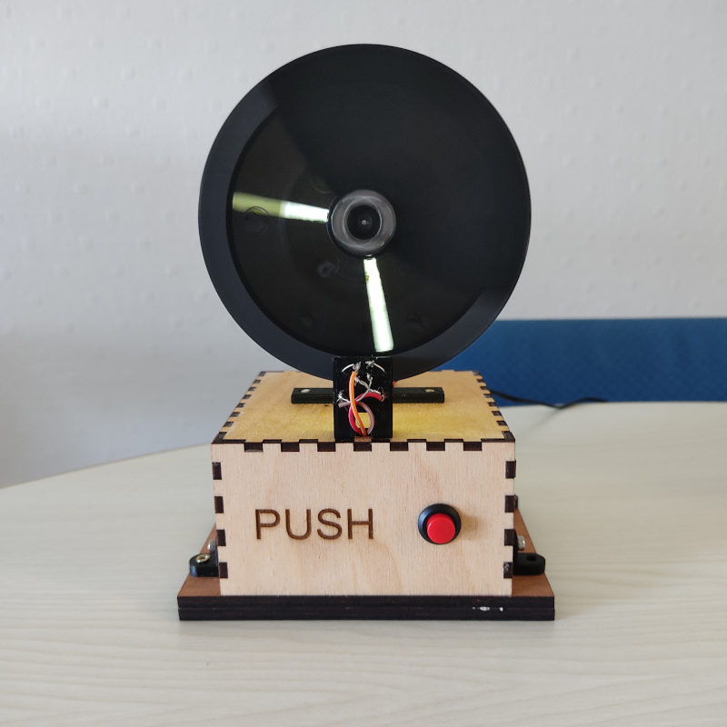

# Horloge à persistence rétinienne

## Principe
Un disque muni d'une fente tourne sur son axe. Des leds s'allumeent périodiquement pour visualiser les aiguilles des heures et des minutes. Un boutaon poussoir permet de démarrer la rotation ou l'arrêt du disque. Deux boutons poussoirs à l'arrière permettent de régler l'heure et les minutes. L'heure est sauvegarder dans un circuit RTC.

##  Mécanique
Le boitier et le socle sont en contreplaqué 5mm découpé au laser. Les autres pièces sont réalisées en impression 3D.

|Pièce | Fichier source | Fichier de fabrication |
| ---- | -------------- | ---------------------- |
| Boitier | box.lbrn2  | box.dxf                 |
| Socle (2) | socle.lbrn2  | socle.dxf |
 | Coupelle | coupelle.scad | coupelle.stl |
| Disque | screen3.scad | screen3.stl |
|Support coupelle | supmoteur.scad | sup1.stl |
|Support coupelle | supmoteur.scad | sup2.stl |
|Support coupelle | supmoteur.scad | sup3.stl |
| Support CNY70 | cny70.scad | cny70.stl |
| Attache boite au socle (4) | attache.scad | attache.stl |

## Electronique

Les composants suivants :

| Composant | Quantité |
| --------- | -------- |
| Arduino uno | 1 |
| CNY70 | 1 |
| BD139 | 2 |
 | MOSFET | 1 |
 |Module horloge DS1302 | 1 |

